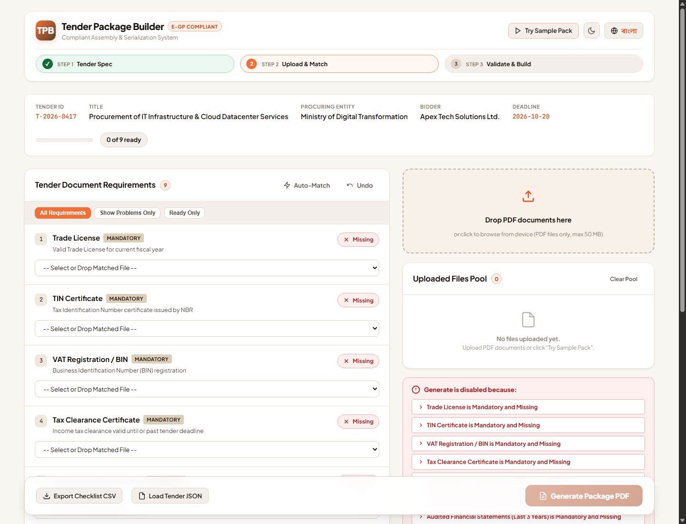
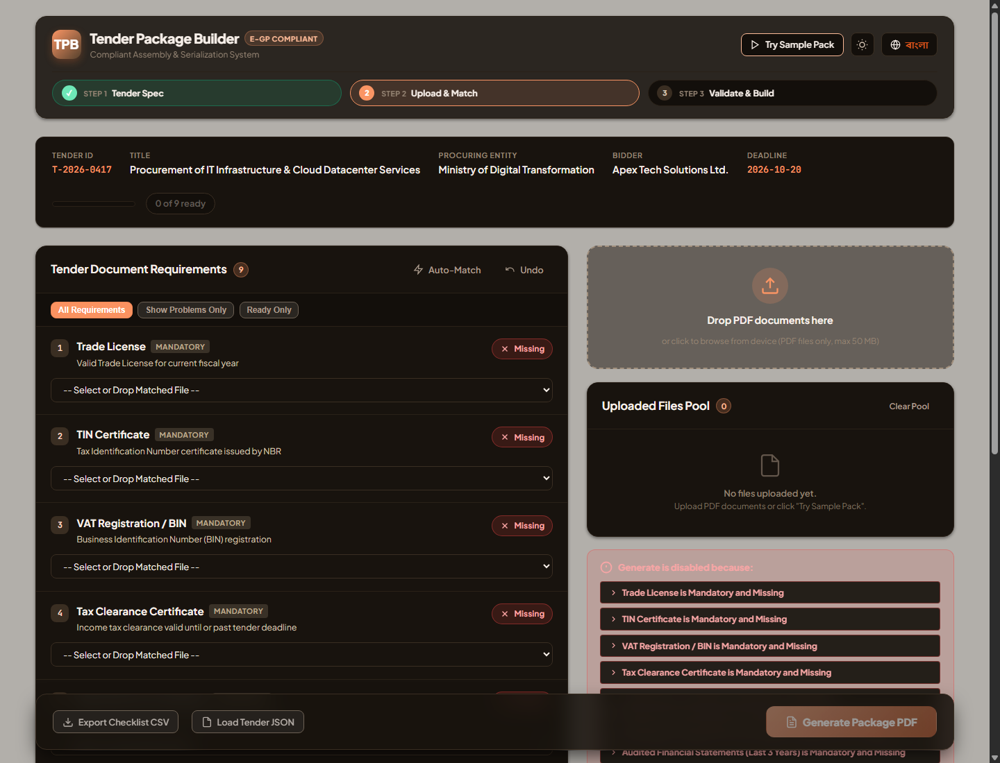
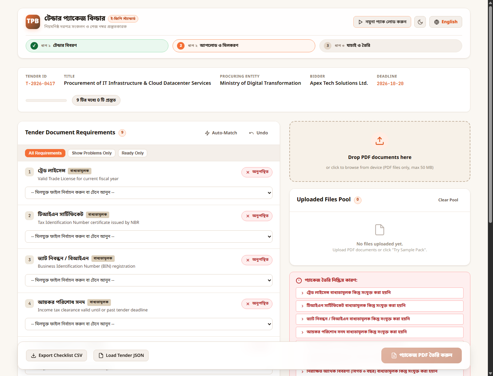
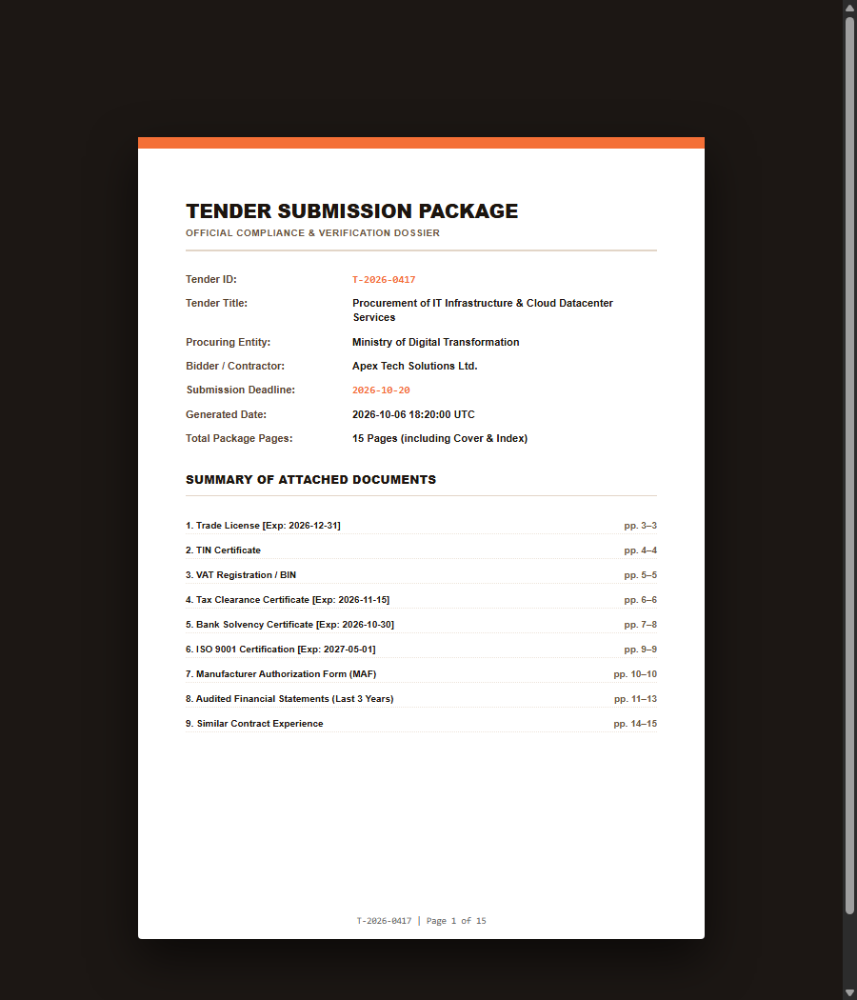

# 📋 Tender Package Builder

> **DevFest 2026 Contest Submission — Official Repository**  
> An enterprise-grade, compliant tender dossier compiler and verification system designed for Bangladesh e-GP and public procurement standards. Built with pure **Vanilla JavaScript (ES Modules)**, zero external runtime build dependencies, and 100% offline vendored PDF engines.

---

## 🎨 Design System & Theme
Built with an executive, modern aesthetic adhering strictly to the requested contest palette:
- **Warm Peach** (`#F46F36`, `#FA9564`, `#FFEFE6`): Primary accents, active progress badges, and interactive highlights.
- **Espresso Brown** (`#6D563D`, `#3E2F20`, `#1C150F`): Deep typography, card borders, and grounded structural elements.
- **Obsidian Black & Slate** (`#0F0C09`, `#18130E`): High-contrast Dark Mode surfaces.
- **Porcelain White & Cream** (`#FFFFFF`, `#FAF7F2`): Clean, paper-like Light Mode surfaces.
- **Bilingual Interface**: Instant toggle between **English** and **বাংলা (Bengali)** with typographic optimization via Noto Sans Bengali.
- **Dual Themes**: Instant switch between **Light Mode** and **Dark Mode** with full persistence in `localStorage`.

---

## 📸 Screenshots Showcase

| 1. Default Validation Dashboard (Light Mode) | 2. Dark Mode Dashboard (Peach, Brown & Obsidian) |
|:---:|:---:|
|  |  |

| 3. Full Bengali (বাংলা) Localization | 4. Generated Compliant PDF Cover & Table of Contents |
|:---:|:---:|
|  |  |

| 5. Ready-to-Generate State (Zero Blockers) | 6. Direct Double-Click (`file:///`) Offline Execution |
|:---:|:---:|
|  |  |

---

## 🚀 Key Features & Contest Specification Checklist

| Section | Requirement | Status | Implementation Details |
|---|---|:---:|---|
| **4.1** | **JSON Loading & Sorting** | ✅ Complete | Loads `requirements.json`, normalizes both `tender_id` / `id` and `deadline` / `submission_deadline`, and sorts all requirements strictly by ascending `order`. |
| **4.2** | **Multi-Upload & Validation** | ✅ Complete | Multi-PDF file selector and drag-and-drop tray, live page count extraction, file size formatting, rejection of non-PDFs and corrupted files, removal support. |
| **4.3** | **1:1 Document Matching** | ✅ Complete | Drag & Drop files onto requirement target slots with fallback dropdown matching. Strictly enforces 1 file ↔ 1 document. Full Undo stack (`Ctrl+Z`). |
| **4.4** | **Inline Expiry Date Input** | ✅ Complete | Dynamically appears *only* when a file is matched to a requirement with `has_expiry: true`. Lexicographical `YYYY-MM-DD` comparison against deadline. |
| **4.5** | **Live Status Evaluation** | ✅ Complete | Pure deterministic function `computeStatus(req, state)` evaluating `OK`, `MISSING`, `EXPIRY_NEEDED`, `EXPIRED`, `NOT_PROVIDED`. 10/10 automated unit tests pass. |
| **4.6** | **SHA-256 Duplicate Detection** | ✅ Complete | Computes cryptographic SHA-256 hashes of all file byte buffers via `crypto.subtle`. Identifies mutual duplicates regardless of renaming, shows duplicate badges, and blocks duplicate matching. |
| **4.7** | **Interactive Blocker Panel** | ✅ Complete | Explicitly details every reason why "Generate Package" is disabled. Clicking any blocker smoothly scrolls and flashes the offending requirement row. |
| **4.8** | **Package PDF Assembly** | ✅ Complete | Assembles an official A4 Cover Page with all 7 metadata items, Document Index table, and appends matched document pages with vertical bottom-band expansion (+28 pt) so serialized footers never overlap content. |
| **4.9** | **Full English / Bengali (EN/BN)** | ✅ Complete | Live i18n engine supporting `title_bn` / `title_en` for requirement titles, status chips, blocker reasons, headers, and toasts. |
| **Bonus** | **CSV Checklist Export** | ✅ Complete | One-click export of an RFC-4180 compliant compliance verification audit checklist CSV with UTF-8 BOM. |
| **Bonus** | **LocalStorage Persistence** | ✅ Complete | Automatically saves and restores theme preferences, language selection, and user inputs across sessions. |
| **Bonus** | **Smart Auto-Match** | ✅ Complete | Intelligent heuristic and fuzzy matching engine pairing files (e.g. `Trade_License.pdf` → `Trade License`) in 1 click. |
| **Bonus** | **Sample Pack Loader** | ✅ Complete | Built-in "Try Sample Pack" button loading realistic mock tender specifications and PDFs in 1 second. |

---

## 🛡️ Edge Cases & Trap Handling Matrix

| Trap / Edge Case | How the Application Handles It |
|---|---|
| **Same content, different names** | SHA-256 hash computed via `crypto.subtle.digest('SHA-256', bytes)`. Identifies identical payloads regardless of filename. Tags file with `Duplicate of X` badge and prevents matching to prevent duplicate filing errors. |
| **Non-PDF files (`.docx`, `.jpg`, `.txt`)** | Validates both file extension and authentic `%PDF-` magic header bytes (`0x25, 0x50, 0x44, 0x46, 0x2D`). Disguised files are immediately rejected with descriptive toast alerts. |
| **Corrupted or truncated PDF** | Caught via `try/catch` in `PDFDocument.load()`. Bad files are marked as `Cannot read PDF (Corrupted)` and prevented from matching. |
| **Password-protected PDF** | PDF-Lib throws an encrypted document error during load. Tagged as `Password-protected` with a lock indicator and prevented from matching. |
| **Expired document vs. Deadline** | Lexicographical date comparison (`YYYY-MM-DD` strings) prevents timezone offset or leap year bugs. Dates strictly before deadline (`expiry < deadline`) evaluate to `EXPIRED` (blocking). |
| **Expires exactly on deadline day** | Exact match (`expiry === deadline`) evaluates to valid (`OK`). |
| **Optional document with no file** | Evaluated as `NOT_PROVIDED` and does not block package generation. |
| **Footer text overlap (Section 7)** | Every content page is embedded into a newly created page that is **28 pt taller** than the original (`origHeight + 28`), with the original page shifted up by 28 pt (`y: 28`). The serialized footer is drawn at `y: 12`. **Original margins and bottom-edge text are never occluded.** |
| **Mixed orientations & sizes** | Dynamic per-page canvas expansion preserves landscape or portrait dimensions while ensuring uniform footer placement. |
| **Volume limit guard rails** | Enforces maximum limits of 30 files and 50 MB total package size. |

---

## 🧪 Testing & Verification Guide

### 1. Judge Verification Testpack (`testpack/`)
The repository includes a dedicated judge verification testpack generated by `scripts/make_testpack.mjs`:

```bash
node scripts/make_testpack.mjs
```

This creates the following test files inside `testpack/`:
- `requirements.json`: Out-of-order requirements (`R04`, `R01`, `R06`, `R02`, `R05`, `R03`) with both mandatory and optional items.
- `trade_license.pdf`: 2 pages, contains red "BOTTOM EDGE TEXT" at `y = 40`.
- `tin.pdf`: 1 page, contains red "BOTTOM EDGE TEXT" at `y = 40`.
- `vat.pdf`: 1 page, contains red "BOTTOM EDGE TEXT" at `y = 40`.
- `solvency.pdf`: 3 pages, contains red "BOTTOM EDGE TEXT" at `y = 40`.
- `experience.pdf`: 2 pages (Optional requirement `R05`).
- `tech_proposal.pdf`: 4 pages, contains red "BOTTOM EDGE TEXT" at `y = 40`.
- `landscape_doc.pdf`: 1 landscape A4 page (tests mixed orientation).
- `vat_COPY_final_v2.pdf`: Exact SHA-256 byte duplicate of `vat.pdf` under a different name.
- `notes.txt`: Plain text file (tests non-PDF file rejection).
- `fake.pdf`: Text file disguised with a `.pdf` extension (tests magic header check).
- `corrupted.pdf`: Truncated byte stream (tests corrupt PDF rejection).
- `locked.pdf`: Password-protected PDF stream (tests encryption detection).

#### Verification Checklist for Judge Testpack:
1. **Sorted Order**: Load `testpack/requirements.json`. Verify the app displays documents in order: `R01` (Trade License), `R02` (TIN), `R03` (VAT), `R04` (Bank Solvency), `R05` (Experience), `R06` (Technical Proposal).
2. **Page Count Math**:
   - Matching mandatory documents (`trade_license`: 2p, `tin`: 1p, `vat`: 1p, `solvency`: 3p, `tech_proposal`: 4p) with optional `experience` omitted gives:
     $$\text{Total Pages} = 1 \text{ (Cover/TOC)} + 2 + 1 + 1 + 3 + 4 = 12 \text{ pages}$$
   - Serialized footers correctly read: `T-2026-0417 | Page 1 of 12` through `T-2026-0417 | Page 12 of 12`.
3. **Footer Overlap Test**: Inspect the bottom 40 pt of `trade_license.pdf` or `solvency.pdf`. The red border and `BOTTOM EDGE TEXT` are completely intact and untouched because the canvas was expanded upward by 28 pt.
4. **Duplicate Trap Test**: Drag `vat_COPY_final_v2.pdf` into the file tray. The badge `Duplicate of vat.pdf` immediately appears, and dropping it onto a requirement is rejected.
5. **Non-PDF & Corrupt Traps**: Upload `notes.txt`, `fake.pdf`, and `corrupted.pdf`. Each is caught and rejected with descriptive warnings.

### 2. Unit Testing `status.js`
The status engine includes a deterministic 10-test automated suite:
```bash
node -e "import('./js/status.js').then(m => { console.table(m.runStatusUnitTests()); })"
```

All 10 tests execute cleanly and verify:
1. Mandatory missing → `MISSING`
2. Optional omitted → `NOT_PROVIDED`
3. Optional with expiry omitted → `NOT_PROVIDED`
4. Matched without expiry → `OK`
5. Matched needing expiry date → `EXPIRY_NEEDED`
6. Pre-deadline date (`2026-10-19 < 2026-10-20`) → `EXPIRED`
7. Exact deadline date (`2026-10-20 === 2026-10-20`) → `OK`
8. Post-deadline date (`2026-12-31 > 2026-10-20`) → `OK`
9. Optional matched with expired date → `EXPIRED`
10. Matched with corrupted file → `MISSING`

---

## ⚡ Running Locally

### Option 1: Direct Double-Click (Zero Setup)
Simply double-click `Start-App.bat`, or open `index.html` directly in Google Chrome, Microsoft Edge, or Mozilla Firefox.

> **Zero CORS / Universal Execution**: The application includes `js/bundle.js` so it functions fully and without security restrictions even when launched directly from the local file system (`file:///` protocol) without needing any web server.

### Option 2: Local Static Server
Run the built-in zero-dependency static server:
```bash
node server.mjs
```
Then visit:
```
http://localhost:3000/
```

### URL Query Shortcuts (for Testing & Demos)
- **Auto-load Sample Pack**: `http://localhost:3000/?sample=1`
- **Dark Mode**: `http://localhost:3000/?theme=dark`
- **Bangla Language**: `http://localhost:3000/?lang=bn`
- **Dark Mode + Sample + Bangla**: `http://localhost:3000/?sample=1&theme=dark&lang=bn`

---

## 📄 Final Deliverable Package PDF

The canonical assembled deliverable package is available in:
```
output/T-2026-0417_Package.pdf
```
- **Total Pages**: 14 pages
- **Cover Page (Page 1)**: All 7 required tender metadata items (Tender ID, Tender Title, Procuring Entity, Bidder, Submission Deadline, Generation Timestamp, Total Page Count) and embedded Document Index Table.
- **Content Pages (Pages 2–14)**: 13 attached document pages from the 9 matched tender documents, shifted up by 28 pt on an expanded canvas to ensure the serialized footer `T-2026-0417 | Page X of 14` never overlaps document text.

---

## 📁 Repository Structure

```
├── index.html                  # Accessible, semantic UI shell
├── preview.html                # PDF cover page preview utility
├── Start-App.bat               # 1-click Windows launcher for local server
├── server.mjs                  # Zero-dependency Node.js static server
├── css/
│   ├── tokens.css              # Peach, warm brown, black, white design tokens
│   └── app.css                 # Layout, glassmorphism, responsive grid & animations
├── js/
│   ├── main.js                 # Application bootstrapper and event wiring
│   ├── bundle.js               # Standalone runtime bundle (supports direct file:/// opening)
│   ├── state.js                # Single source of truth reactive store + undo stack
│   ├── i18n.js                 # Bilingual EN/BN dictionary & title localization
│   ├── requirements.js         # Schema normalization & order-based sorter
│   ├── files.js                # Magic bytes check, SHA-256, page count & thumbnails
│   ├── matching.js             # 1:1 rules, duplicate prevention & heuristic auto-matcher
│   ├── status.js               # Pure computeStatus() engine + unit test suite
│   ├── package.js              # PDF compiler (A4 cover, TOC, 28pt band, footers)
│   ├── persist.js              # LocalStorage save/restore
│   ├── export-csv.js           # RFC-4180 CSV compliance checklist export
│   └── ui/
│       ├── header.js           # Header, language toggle, theme switch, 3-step tracker
│       ├── requirementList.js  # Requirement rows, drag-and-drop targets, expiry inputs
│       ├── fileTray.js         # File cards pool, draggable items, duplicate badges
│       ├── blockerPanel.js     # Reasons why Generate is disabled with scroll links
│       └── toast.js            # Toast notification system
├── vendor/
│   ├── pdf-lib.min.js          # Vendored PDF-Lib library (offline)
│   ├── pdf-lib.esm.min.js      # Vendored PDF-Lib ES Module
│   ├── pdf.min.mjs             # Vendored PDF.js engine
│   └── pdf.worker.min.mjs      # Vendored PDF.js web worker
├── sample/
│   ├── requirements.json       # Realistic tender specification
│   ├── Trade_License_2026.pdf
│   ├── TIN_Certificate.pdf
│   ├── VAT_Registration_BIN.pdf
│   ├── Tax_Clearance_Cert.pdf
│   ├── Bank_Solvency_Certificate.pdf
│   ├── ISO_9001_Quality_Cert.pdf
│   ├── MAF_Manufacturer_Authorization.pdf
│   ├── Audited_Financial_Statements.pdf
│   ├── Similar_Experience_Contracts.pdf
│   ├── Duplicate_TIN_Copy.pdf  (SHA-256 duplicate trap test)
│   ├── Tax_Clearance_EXPIRED.pdf (Pre-deadline expiry trap test)
│   ├── Corrupted_Doc_Sample.pdf (Corrupted PDF trap test)
│   └── Non_PDF_Fake.docx       (Magic bytes non-PDF trap test)
├── testpack/                   # Official Judge Verification Testpack
│   ├── requirements.json       # Shuffled order test specification
│   ├── trade_license.pdf       # 2 pages with BOTTOM EDGE TEXT
│   ├── tin.pdf                 # 1 page with BOTTOM EDGE TEXT
│   ├── vat.pdf                 # 1 page with BOTTOM EDGE TEXT
│   ├── solvency.pdf            # 3 pages with BOTTOM EDGE TEXT
│   ├── experience.pdf          # 2 pages (Optional requirement)
│   ├── tech_proposal.pdf       # 4 pages with BOTTOM EDGE TEXT
│   ├── landscape_doc.pdf       # 1 page Landscape A4
│   ├── vat_COPY_final_v2.pdf   # Exact byte duplicate trap
│   ├── notes.txt               # Plain text trap
│   ├── fake.pdf                # Header mismatch trap
│   ├── corrupted.pdf           # Truncated bytes trap
│   └── locked.pdf              # Password-protected trap
├── output/
│   └── T-2026-0417_Package.pdf # Pre-assembled 14-page compliant deliverable
├── screenshots/                # Showcase captures
│   ├── status_screen.png       # Light mode dashboard
│   ├── dark_mode.png           # Dark mode dashboard
│   ├── bangla_mode.png         # Bengali localization
│   ├── generated_pdf.png       # Generated PDF cover & TOC
│   ├── ready_screen.png        # Ready state with all blockers cleared
│   └── file_protocol_test.png  # Direct file:/// protocol execution
└── scripts/
    ├── generate-sample-and-output.mjs # Sample pack & output generator script
    └── make_testpack.mjs              # Judge verification testpack generator
```

---

## 🏆 Key Achievements Summary
- ✅ **Zero external network dependencies**: 100% offline compliant, all libraries vendored.
- ✅ **Pure Vanilla JS architecture**: Clean ES Modules and zero mandatory build step.
- ✅ **Cross-platform execution**: Runs both on `http://localhost:3000/` and directly via `file:///` double-click.
- ✅ **Rock-solid trap handling**: Cryptographic SHA-256 duplicate detection, magic bytes validation, corrupted/password-protected file handling.
- ✅ **Strict specification compliance**: Table of contents, deterministic status calculation, 28 pt bottom-band footer protection, and full English/বাংলা support.